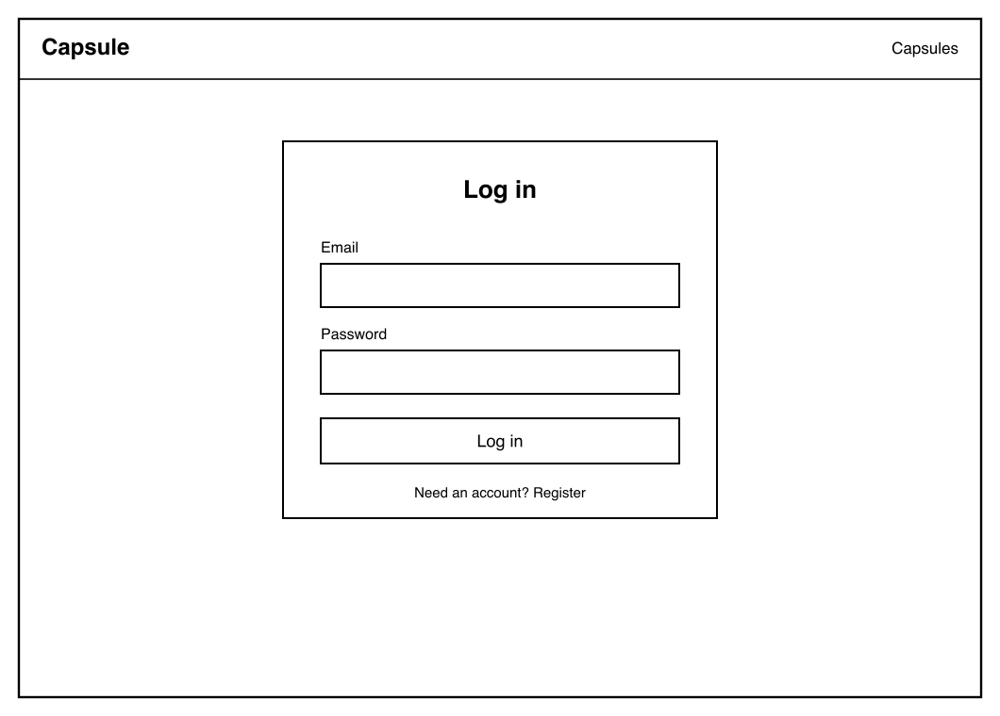
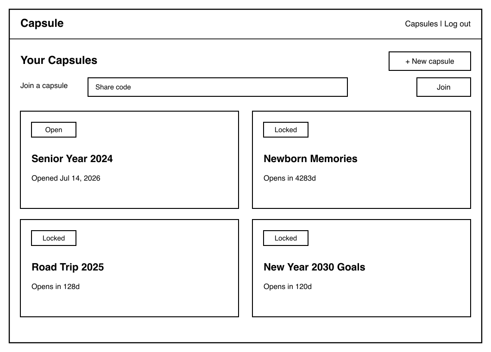
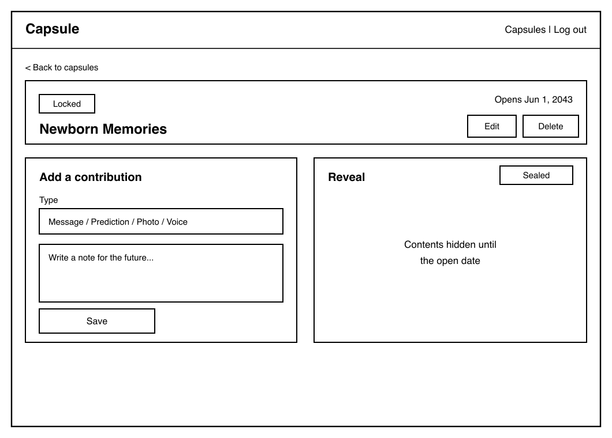
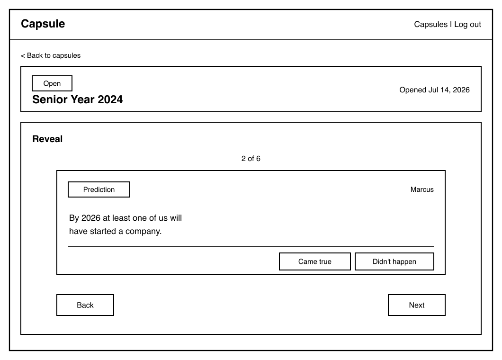

# Capsule — Design Document

**CS5610 Web Development — Northeastern University**
Class link: <https://johnguerra.co/classes/webDevelopment_online_summer_2/>

**Team**

- Alexandra (Ally) Descoteaux — Contributions and Reveal
- James Hicks — Authentication, Capsules, and Invites

---

## 1. Project Description

Capsule is a full-stack web application designed as a digital time capsule.

A user creates a capsule with a title and an open date, then invites friends or family via a share
code. Invitees contribute messages, photos, predictions, and voice notes to the capsule, but once
locked, nobody can view any contents until the open date arrives.

The constraint is the product. Anyone can add to a capsule while it is sealed, but no one — not
even the person who created it — can read what is inside until the open date passes. That
enforced wait is what turns a folder of files into an occasion. The reveal becomes a shared
moment for everyone who took part.

Sealing is enforced on the server, not merely hidden in the interface. A locked capsule's
description and its contributions are stripped from the API response before it is sent, so a
sealed capsule's contents are not present in the payload at all.

---

## 2. User Personas

### Maya — New Parent

Wants to create a capsule for her newborn and invite grandparents and close friends to send
messages and photos she and her child will open together on his 18th birthday.

### Devon — High School Teacher

Runs an end-of-year capsule for his senior class where students write predictions about where
they'll be in ten years, until the class reunion.

### Logan — College Friend Group

Wants to seal a group capsule with college friends on graduation day and open it together at
their five-year reunion.

---

## 3. User Stories

### User Goal 1 — Capsules & Invites _(James Hicks)_

As a user, I want to register, log in, and log out so my capsules and contributions stay private.
As a user, I want to create a capsule with a title and open date so I can set the moment of
reveal. As a user, I want to invite people with a share code so anyone I trust can join and
contribute. As a user, I want to see a list of my capsules with a lock status and countdown so I
know what's locked and when each one opens.

### User Goal 2 — Contributions & Reveal _(Alexandra Descoteaux)_

As a contributor, I want to add a written message to a capsule so my words are preserved until
the open date. As a contributor, I want to upload a photo to a capsule so a visual memory is
included in the reveal. As a contributor, I want to submit a prediction to a capsule so I can
look back and see whether I was right. As a contributor, I want to record a voice note so a spoken
memory is preserved for the reveal. As a contributor, I want to open a capsule's contents one at a
time as a reveal ceremony once its open date has passed so the reveal is a shared moment for
everyone who took part. As an owner, I want to mark each prediction as having come true or not once
the capsule is open so we can see who called it.

---

## 4. Design Mockups

Hand-drawn wireframes for the four primary screens.

### 4.1 Login / Register

Failed credentials render an inline alert above the form. On success the user is redirected to
the capsule list.

### 4.2 Capsule List — lock status and countdown

Sealed cards show "Sealed until the open date" in place of the description and a live countdown.
**The share code appears only on capsules the viewer owns** — it is removed server-side for
everyone else.

### 4.3 Capsule Detail — sealed

Owner-only Edit and Delete controls. The count of contributions is shown; their contents are not
sent to the client at all.

### 4.4 Capsule Detail — revealed

Once the open date passes, the capsule unlocks. Its contents can be opened as a step-by-step reveal
ceremony — one message, photo, prediction, or voice note at a time — or viewed all at once. The
owner can mark each prediction as having come true or not.

---

## 5. Data Model

Two collections owned by James, one by Alexandra. MongoDB via the native driver.

### `users` _(James)_

| Field          | Type     | Notes                                         |
| -------------- | -------- | --------------------------------------------- |
| `_id`          | ObjectId |                                               |
| `name`         | string   | Display name                                  |
| `email`        | string   | Lowercased; unique index                      |
| `passwordHash` | string   | bcrypt, cost 10. Stripped from every response |

### `capsules` _(James)_

| Field         | Type     | Notes                                                     |
| ------------- | -------- | --------------------------------------------------------- |
| `_id`         | ObjectId |                                                           |
| `name`        | string   | Title                                                     |
| `description` | string   | **Removed from responses while locked**                   |
| `openDate`    | string   | Calendar date; drives lock state                          |
| `owner`       | ObjectId | Creator                                                   |
| `members`     | string[] | Joined user IDs, `$addToSet`                              |
| `shareCode`   | string   | 8 chars, unique sparse index. **Owner-only in responses** |
| `createdAt`   | Date     |                                                           |

### `contributions` _(Alexandra)_

| Field          | Type          | Notes                                                    |
| -------------- | ------------- | -------------------------------------------------------- |
| `_id`          | ObjectId      |                                                          |
| `capsuleId`    | ObjectId      | Parent; cascade-deleted with the capsule                 |
| `authorId`     | ObjectId      | Contributor                                              |
| `authorName`   | string        | Contributor's display name at time of writing            |
| `type`         | string        | `message` \| `prediction` \| `photo` \| `voice`          |
| `content`      | string        | Text body, or an optional caption for photo/voice        |
| `photoDataUrl` | string\|null  | Base64 data URL for `photo` contributions                |
| `photoName`    | string\|null  | Original file name for photos                            |
| `audioDataUrl` | string\|null  | Base64 data URL for `voice` contributions                |
| `audioName`    | string\|null  | File name for voice notes                                |
| `outcome`      | boolean\|null | Predictions only; `null` until the owner resolves it     |
| `createdAt`    | Date          |                                                          |
| `updatedAt`    | Date          | Set when a contribution is edited or a prediction judged |

**Lock state is derived, never stored.** A capsule is locked when `openDate > now`, computed on
every read. Capsules open on time with no scheduled job, and the lock cannot drift out of sync
with the date.

---

## 6. Architecture

**Stack:** Node + Express + MongoDB (native driver) + React with hooks, built by Vite.
No axios, no Mongoose, no CORS — `fetch` on the client, the native driver on the server, and a
Vite dev proxy that makes the frontend and API same-origin.

**Authentication:** Passport with a local strategy over `express-session`. Passwords are bcrypt
hashed. The session cookie is `httpOnly` with `sameSite: lax`, and `secure` in production; the app
sets `trust proxy` so that secure cookie is issued correctly behind the host's HTTPS proxy.

**API**

| Method | Route                                                     | Purpose                                  |
| ------ | --------------------------------------------------------- | ---------------------------------------- |
| POST   | `/api/auth/register`                                      | Create account                           |
| POST   | `/api/auth/login`                                         | Log in                                   |
| POST   | `/api/auth/logout`                                        | Log out                                  |
| GET    | `/api/auth/user`                                          | Current session user                     |
| GET    | `/api/capsules`                                           | Capsules owned or joined                 |
| POST   | `/api/capsules`                                           | Create                                   |
| GET    | `/api/capsules/:id`                                       | One capsule                              |
| PUT    | `/api/capsules/:id`                                       | Update _(owner)_                         |
| DELETE | `/api/capsules/:id`                                       | Delete + cascade _(owner)_               |
| POST   | `/api/capsules/join`                                      | Join by share code                       |
| POST   | `/api/capsules/:id/contributions`                         | Add                                      |
| PUT    | `/api/capsules/:id/contributions/:contributionId`         | Edit _(author)_                          |
| DELETE | `/api/capsules/:id/contributions/:contributionId`         | Delete _(author)_                        |
| PATCH  | `/api/capsules/:id/contributions/:contributionId/outcome` | Resolve prediction _(owner, after open)_ |

**Authorization.** Every capsule route requires a session. Access requires ownership or
membership; the list query and the single-capsule check apply the same rule. Sealing is enforced
in the model layer at serialization, so it holds no matter which route reads the capsule.

---

## 7. Division of Work

**James Hicks — Authentication, Capsules, and Invites.** Register/login/logout via Passport;
capsule creation with title and open date; the share-code join flow; the capsule list with lock
status and countdown. Owns the `users` and `capsules` collections full stack (React + Express +
Mongo), with full CRUD on `capsules`.

**Alexandra Descoteaux — Contributions and Reveal.** CRUD for message, photo, prediction, and
voice-note contributions; the reveal view that returns contents only after the open date, opened
as a step-by-step reveal ceremony; and owner resolution of predictions as true or false once a
capsule is open. Owns the `contributions` collection full stack (React + Express + Mongo).
